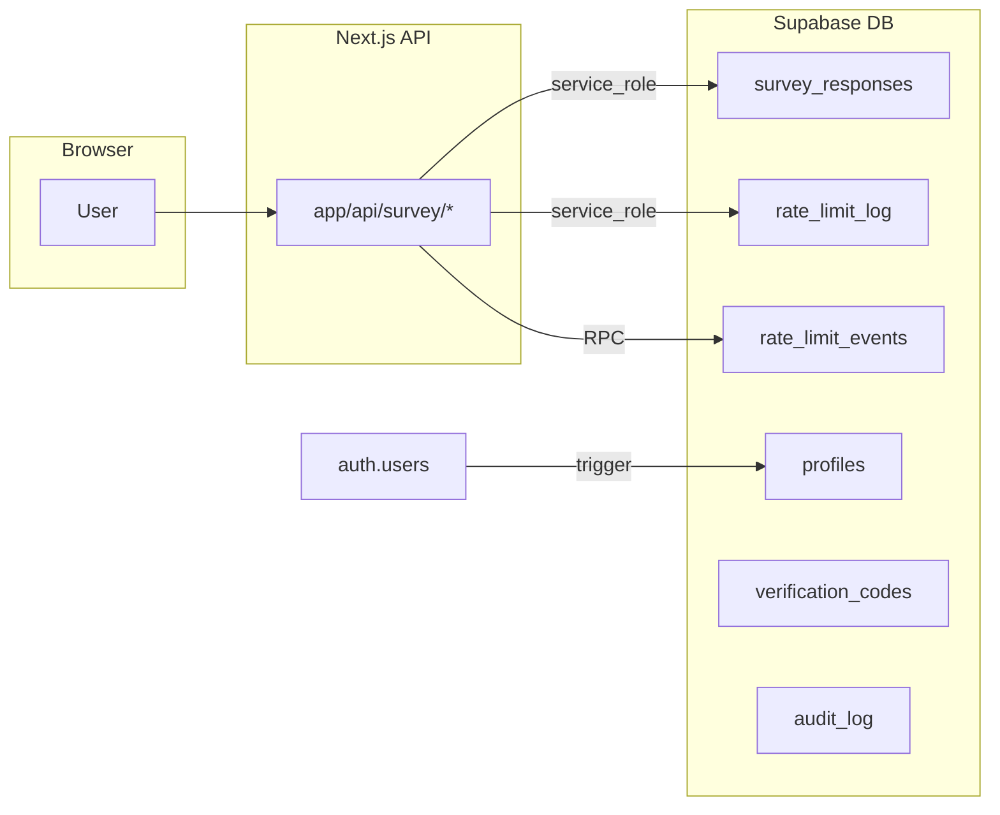

# Database schema (`sql/`)

This folder defines **PostgreSQL / Supabase** objects: tables, views, RLS policies, and helper functions.

**How to apply:** run scripts in **`Create/`** in order: `00_schema_baseline.sql`, then `01` … `09`.  
**Or run everything at once:** **`Create_All.sql`** in the `sql/` folder concatenates `Create/00` … `Create/09` in order (including the read-only verification `SELECT`s at the end). After you edit any file under `Create/`, regenerate `Create_All.sql` with:

```powershell
Set-Location path\to\treasure-nextjs\sql
$files = 'Create/00_schema_baseline.sql','Create/01_profiles.sql','Create/02_survey_responses.sql','Create/03_verification_codes.sql','Create/04_audit_log.sql','Create/05_rate_limit_log.sql','Create/06_rate_limit_events.sql','Create/07_view_redacted.sql','Create/08_helper_functions.sql','Create/09_verification_queries.sql'
$header = @"
-- =============================================================================
--  CREATE ALL -- full schema (sql/Create/00 through 09 in order)
--  Regenerate after editing individual files: see sql/README.md
-- =============================================================================

"@
$body = ($files | ForEach-Object { "-- SECTION: $_`r`n" + (Get-Content -Raw -Encoding UTF8 $_) + "`r`n" }) -join "`r`n"
Set-Content -Path 'Create_All.sql' -Value ($header + $body) -Encoding UTF8 -NoNewline
```

**Full teardown (dangerous):** **`Drop_All.sql`** runs the same drops as all files in **`Drop/`**, and also removes **`audit_log`** (no separate `Drop/` script for it). It does **not** drop **`profiles`** or auth/profile triggers. Back up first.

**How the app connects:** server-side API routes use the **Supabase service role** key. Browsers and logged-in users do **not** use that key.

---

## Big picture



- **Survey flow:** API writes/reads **`survey_responses`**, logs limits in **`rate_limit_log`** and **`rate_limit_events`**.  
- **Auth:** new users get a row in **`profiles`** via a database trigger (not from survey code).  
- **`verification_codes`** and **`audit_log`** are mostly **infrastructure** for this repo (see each table below).

---

## Security model

### 1. Who can touch the data?

| Role | Typical use | Access to these tables |
|------|----------------|-------------------------|
| **`anon` / `authenticated`** | Supabase client from the browser, or JWT user | **No direct access** to survey, codes, audit, or rate-limit tables. RLS policies explicitly **deny** all rows for those roles. |
| **`service_role`** | Your Next.js server with the service key | **Full access** (as granted in SQL) — this is how `app/api/...` inserts surveys, runs rate-limit RPCs, etc. |
| **End users** | — | Never receive the service role key. Survey actions go **only** through your API. |

### 2. Row Level Security (RLS)

RLS is **on** for all main tables. For `survey_responses`, `verification_codes`, `audit_log`, `rate_limit_log`, and `rate_limit_events`, a **restrictive** policy blocks **`anon` and `authenticated`** from every operation. That way, even if someone mis-grants table privileges, logged-in clients still see **no rows** unless you add separate permissive policies.

**`profiles` is different:** authenticated users get **SELECT** and **UPDATE** on their own row (and extra rules for admins/owners). **`anon`** has no access to `profiles` in the grants.

### 3. Schema baseline (`00_schema_baseline.sql`)

`PUBLIC`, `anon`, and `authenticated` start with **no default privileges** on schema `public`; then **USAGE** on `public` is granted so normal Supabase clients can resolve object names. Table-level **REVOKE/GRANT** in each script then tightens who can read or write.

### 4. `SECURITY DEFINER` functions

Helpers like `fn_email_exists`, `fn_check_and_record_rate_limit`, and `fn_ip_submission_count` run with the definer’s rights and are granted only to **`service_role`** (not `anon`/`authenticated`). The API calls them via RPC using the service client.

### 5. Secrets and operations

- Keep **`SUPABASE_SERVICE_ROLE_KEY`** only on the server. If it leaks, RLS can be bypassed for your project.  
- **`audit_log`** uses rules so rows cannot be updated or deleted through normal SQL (append-only).  
- **`survey_responses_redacted`** is a view that masks PII for safer reporting if you query it as `service_role`.

---

## Tables (columns and usage)

Below, **“Used by app”** refers to this Next.js repo unless noted.

---

### `profiles`

**In one sentence:** One app profile per Supabase Auth user, with role and approval status.

**Why we have it:** Extends `auth.users` with fields the app can use for admin/editor workflows and RLS on profile data.

**Used by app:** Not queried directly in this repo; row is created when a user signs up (trigger on `auth.users`).

| Column | Type | What it is |
|--------|------|------------|
| `id` | `uuid` | Same as `auth.users.id` (primary key, cascade delete) |
| `email` | `text` | Email (required) |
| `full_name` | `text` | Display name (optional) |
| `role` | `text` | One of: `owner`, `admin`, `editor`, `viewer` (default `viewer`) |
| `status` | `text` | One of: `pending`, `approved`, `rejected` (default `pending`) |
| `avatar_url` | `text` | Profile image URL (optional) |
| `created_at` | `timestamptz` | Row created |
| `updated_at` | `timestamptz` | Auto-updated on profile change (trigger) |

---

### `survey_responses`

**In one sentence:** Each row is one survey signup, including phone verification state.

**Why we have it:** Stores submissions, prevents duplicate email/phone (unique indexes), and drives SMS verification in the API.

**Used by app:** `app/api/survey/route.js`, `verify`, `resend`, `status`. RPCs: `fn_email_exists`, `fn_phone_exists`, `fn_ip_submission_count`.

| Column | Type | What it is |
|--------|------|------------|
| `id` | `bigserial` | Primary key (returned to client in secure session flow) |
| `name` | `text` | Respondent name (length checked in DB, 2–120 chars) |
| `email` | `text` | Optional; must be valid email format or `NULL` |
| `phone` | `text` | E.164 phone (required); unique per normalized digits |
| `frequency` | `text` | How often they play; must match allowed list or empty/`NULL` |
| `ip_address` | `inet` | Client IP at submit time |
| `user_agent` | `text` | Short browser/client string |
| `submitted_at` | `timestamptz` | When the row was created |
| `is_flagged` | `boolean` | Moderation flag (default `false`) |
| `notes` | `text` | Internal notes (optional) |
| `verified` | `boolean` | `true` after successful SMS code check (default `false`) |
| `otp_last_sent_at` | `timestamptz` | Last time an OTP SMS was sent (cooldown/resend) |

---

### `verification_codes`

**In one sentence:** Optional place to store OTP attempts linked to a survey row (designed for hashed codes).

**Why we have it:** Supports a **self-managed** OTP flow and counting sends per phone (`fn_otp_send_count_for_phone`). **This app uses Prelude** for SMS; it does **not** insert here today.

**Used by app:** Not used from JavaScript in this repo.

| Column | Type | What it is |
|--------|------|------------|
| `id` | `uuid` | Primary key |
| `survey_response_id` | `bigint` | FK → `survey_responses.id` (delete cascades) |
| `phone` | `text` | Phone this code was sent to |
| `code` | `text` | Store a **hash** in production if you use this table |
| `expires_at` | `timestamptz` | When the code stops being valid |
| `used` | `boolean` | Whether the code was consumed (default `false`) |
| `attempts` | `integer` | Failed check count (default `0`) |
| `created_at` | `timestamptz` | Row created |

---

### `audit_log`

**In one sentence:** Append-only log of inserts/updates/deletes you choose to record.

**Why we have it:** Audit trail for compliance or debugging; **UPDATE/DELETE** on this table are turned into no-ops by **rules**.

**Used by app:** Table is ready; `fn_audit_log()` exists for triggers, but survey rows are **not** auto-audited by the bundled scripts.

| Column | Type | What it is |
|--------|------|------------|
| `id` | `bigserial` | Primary key |
| `table_name` | `text` | Source table name |
| `operation` | `text` | e.g. `INSERT`, `UPDATE`, `DELETE` |
| `row_id` | `text` | String id of the affected row |
| `old_data` | `jsonb` | Previous row as JSON (often on `DELETE`/`UPDATE`) |
| `new_data` | `jsonb` | New row as JSON (often on `INSERT`/`UPDATE`) |
| `performed_at` | `timestamptz` | When the event was logged |
| `performed_by` | `text` | DB role (default `current_user`) |

**Grants:** `service_role` may **SELECT** and **INSERT** only (no UPDATE/DELETE grants; rules reinforce append-only).

---

### `rate_limit_log`

**In one sentence:** Log of successful survey-related events per IP (for IP submission caps).

**Why we have it:** Powers **`fn_ip_submission_count`** so production can limit submissions per IP over a time window.

**Used by app:** Insert from `app/api/survey/route.js` after success; count via RPC in the same route.

| Column | Type | What it is |
|--------|------|------------|
| `id` | `bigserial` | Primary key |
| `ip_address` | `inet` | Client IP |
| `attempted_at` | `timestamptz` | Event time (default `now()`) |
| `success` | `boolean` | App sets `true` for counted successes (default `false`) |

---

### `rate_limit_events`

**In one sentence:** One row per rate-limit “tick” for a given IP + API route key.

**Why we have it:** Lets **`fn_check_and_record_rate_limit`** work across many serverless instances (advisory lock + count + insert).

**Used by app:** `lib/rateLimit.js` calls the RPC in production (e.g. `survey_post`, `survey_sms_send`).

| Column | Type | What it is |
|--------|------|------------|
| `id` | `bigserial` | Primary key |
| `ip_address` | `inet` | Client IP |
| `route` | `text` | Logical route key (e.g. `survey_post`) |
| `created_at` | `timestamptz` | When this event was recorded (default `now()`) |

---

## Other objects in `Create/`

| Object | Purpose |
|--------|---------|
| **`survey_responses_redacted`** (view) | Same rows as `survey_responses` but with masked email/phone/IP for safer reads. |
| **Functions in `08_helper_functions.sql`** | RPCs for existence checks, rate limits, OTP send counts, cleanup jobs. |
| **`09_verification_queries.sql`** | Read-only checks listing RLS status and policies (run manually if you want). |

---

## `Drop/` folder and `Drop_All.sql`

Individual scripts under **`Drop/`** remove one area at a time (survey stack, rate limits, view, verification codes). **`Drop_All.sql`** is a single script that covers **all** of those plus **`audit_log`**. It intentionally **does not** drop **`public.profiles`** or the auth/profile trigger functions—use manual SQL only if you need to remove those.
